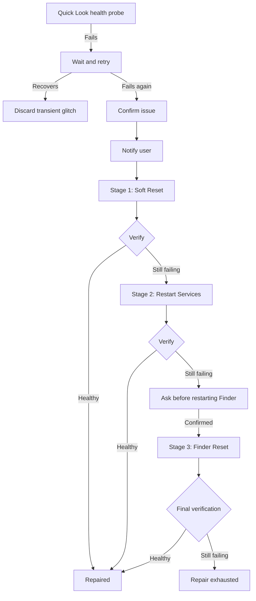

<h1 align="center">⚡ Rebootless</h1>

<p align="center">
  <b>Detect and repair broken macOS subsystems before you reboot.</b>
  <br />
  Native, local, transparent — built with Swift & SwiftUI.
</p>

<p align="center">
  <a href="#status"></a>
  <a href="#installation"></a>
  <a href="#tech-stack"></a>
  <a href="#license"></a>
  <a href="https://github.com/Chaptiv/RebootLess/issues"></a>
</p>

<p align="center">
  <a href="#features">Features</a> &bull;
  <a href="#installation">Installation</a> &bull;
  <a href="#repair-engine--detect--repair--verify">Repair Engine</a> &bull;
  <a href="#supported-subsystems">Subsystems</a> &bull;
  <a href="#tech-stack">Tech Stack</a> &bull;
  <a href="#development">Development</a> &bull;
  <a href="#the-part-nobody-asked-for--the-history-of-rebootless">History</a> &bull;
  <a href="#license">License</a>
</p>

---

## What is Rebootless?

Rebootless is a native macOS utility that tries to answer a simple question:

> **Why reboot the entire Mac when only one subsystem is broken?**

macOS can stay stable for days or weeks while one small part of the system quietly gets stuck: Quick Look stops opening previews, a background daemon hangs, audio stops behaving, DNS gets confused after a VPN change, or Finder starts acting like it has given up on life.

Rebootless is built around a **Detect → Repair → Verify** model. Instead of blindly running a Terminal command and declaring victory, supported subsystems can be monitored, diagnosed, repaired in progressively more disruptive stages, and then functionally checked again before Rebootless reports them as fixed.

For power users, Rebootless also includes direct controls for common macOS services, favorites, custom commands, history, and native menu bar access.

<a id="status"></a>

> **Status:** Technical Preview  
> Full proactive monitoring + staged verified repair is currently implemented for **Quick Look**. Additional subsystems are planned.  
> Requires **macOS 14 Sonoma or newer**. Apple Silicon and Intel Macs are supported.

---

## Features

### Detect → Repair → Verify
The core of Rebootless. A successful shell command is not automatically considered a successful repair.

- **Conservative Health Monitoring** — Functional checks run in the background for supported subsystems.
- **Retry Before Alerting** — A transient glitch is retried before Rebootless confirms a problem.
- **Staged Repair Recipes** — Repairs start with the least disruptive action and escalate only when verification still fails.
- **Functional Verification** — After every repair stage, Rebootless checks the subsystem again before reporting it as fixed.
- **Recovery Detection** — If a subsystem recovers on its own, the active issue is resolved automatically.
- **Issue Deduplication** — One broken subsystem should not become ten identical notifications.

### Local Troubleshooter
Describe what feels broken in normal language:

```text
spacebar preview doesn't work
force touch preview stopped working
can't preview files
```

Rebootless matches the symptom locally against known repair recipes and explains which subsystem is most likely responsible.

There is **no cloud processing, no account, and no LLM** involved in symptom matching.

### Native Notifications
When a monitored issue is confirmed, Rebootless can send a native macOS notification explaining the symptoms and offering a direct **Repair** action.

Repair results can also be delivered as native notifications.

### Direct Service Controls
For problems that do not yet have a full verified Repair Recipe, Rebootless still provides manual one-click controls for **18 built-in macOS services and subsystems**, including:

- Finder
- Dock & Mission Control
- Menu Bar & Control Center
- Notification Center
- Quick Look
- Core Audio
- Wi-Fi
- Bluetooth
- DNS
- AirDrop & Bonjour
- Spotlight
- Siri & Dictation
- Time Machine
- Print Spooler
- WindowServer
- and more

> Direct service controls report whether the command executed successfully. They are intentionally separate from verified Repair Recipes, which additionally diagnose and verify the actual subsystem state.

### Favorites & Menu Bar Access
Pin frequently used controls and access them directly from the macOS menu bar without opening the full dashboard.

### Custom Services
Add your own shell commands for tools or services that Rebootless does not know about yet.

Custom services can define:

- Name and description
- Shell command
- Icon
- Category
- Administrator requirement
- Favorite status

### History & Diagnostics
Rebootless keeps local history for service restarts, detected issues, recoveries, and repair results.

Depending on the action, history can include:

- Timestamp
- Service or subsystem
- Duration
- Exit status
- Repair stages executed
- Verification result
- Command output or error details

### Privacy by Design
Rebootless does not need a backend.

- No account
- No telemetry
- No analytics
- No cloud API
- No remote AI model
- No uploaded diagnostics

Everything runs locally on your Mac.

---

## Repair Engine — Detect → Repair → Verify

The Repair Engine is what separates Rebootless from a collection of `killall` buttons.

A repair recipe contains:

1. **Diagnostic checks**
2. **One or more repair stages**
3. **Functional verification checks**
4. **Impact and confirmation rules**
5. **Symptoms and keywords for local matching**

The engine executes repair stages sequentially and stops as soon as verification confirms that the subsystem is healthy.

```text
Health Check
    |
    v
Problem?
  /   \
 No    Yes
 |      |
Done   Retry
         |
         v
      Still broken?
       /       \
     No         Yes
     |           |
   Done      Confirm issue
                 |
                 v
             Repair Stage 1
                 |
                 v
              Verify
              /   \
           Fixed   Still broken
             |          |
           Done     Repair Stage 2
                        |
                        v
                     Verify
                        |
                       ...
```

A command exiting with code `0` only means that the command executed successfully. Rebootless only uses **Fixed** when the configured verification checks also report the subsystem as healthy.

If a repair recipe has no automatic verification available, Rebootless reports the repair as **executed but unverified** instead of pretending the problem is solved.

---

## Quick Look — The Reference Implementation

Quick Look is the first subsystem with the full Rebootless architecture.

It was chosen because a broken Quick Look session can look deceptively small — Spacebar or Force Click previews simply stop working — while the rest of macOS appears completely normal.

### What Rebootless Checks

The Quick Look diagnostics inspect four distinct layers:

| Layer | What is checked |
|---|---|
| **Generation** | Whether Quick Look can generate preview/thumbnail data |
| **Daemon** | Whether the relevant Quick Look background services respond |
| **UI / Presentation** | Whether an obvious UI service failure or zombie state is present |
| **Finder Integration** | Whether Finder's event loop and Quick Look integration are responding |

The active on-screen preview window cannot always be conclusively tested without interfering with the user session. In that case, Rebootless deliberately reports the UI presentation layer as **unknown** rather than falsely claiming it is healthy.

### Repair Stages

| Stage | Action | Impact | Confirmation |
|---|---|---:|:---:|
| **1 — Soft Reset** | Reload Quick Look generators and flush the thumbnail cache | Minimal | No |
| **2 — Service Restart** | Restart Quick Look UI/background services and reload Quick Look | Low | No |
| **3 — Finder Integration Reset** | Restart Finder to clear stuck preview hooks | Moderate | **Yes** |

After every stage, the Quick Look functional verification runs again.



---

## Supported Subsystems

The long-term goal is not to restart everything aggressively. Each subsystem should eventually get its own conservative health probe, staged repair recipe, and meaningful verification.

| Subsystem | Status | Monitoring | Staged Repair | Verification |
|---|:---:|:---:|:---:|:---:|
| **Quick Look Previews** | **Available** | ✅ | ✅ | ✅ |
| **Core Audio — Sound & Mic** | Planned | Planned | Planned | Planned |
| **DNS & Name Resolution** | Planned | Planned | Planned | Planned |
| **Finder Subsystem** | Planned | Planned | Planned | Planned |
| **Spotlight Indexer** | Planned | Planned | Planned | Planned |

The existing manual service controls remain available independently while more subsystems are promoted to full verified Repair Recipes.

---

## Built-in Manual Service Catalog

<details>
<summary><b>Show all 18 built-in controls</b></summary>

<br />

| Category | Service | Typical Problems | Admin? |
|---|---|---|:---:|
| System UI | **Finder** | Frozen desktop, stuck file operations, broken folder views | No |
| System UI | **Dock & Mission Control** | Missing Dock, stuck badges, Mission Control / Stage Manager glitches | No |
| System UI | **Menu Bar & Control Center** | Frozen menu extras, clock, battery or Control Center | No |
| System UI | **Notification Center** | Stuck banners, widgets, delayed notifications | No |
| System UI | **Quick Look Previews** | Blank or missing Spacebar file previews | No |
| System UI | **Wallpaper Agent** | Black desktop, frozen dynamic wallpaper | No |
| System UI | **Touch Bar & Control Strip** | Frozen or black Touch Bar on supported Macs | No |
| Audio & Media | **Core Audio** | No sound, crackling, broken microphone, AirPods output issues | **Yes** |
| Audio & Media | **AirPlay & Sidecar** | Mirroring disconnects, Sidecar connection failures | No |
| Networking | **DNS Cache** | Sites not resolving after VPN/DNS/network changes | No |
| Networking | **Bluetooth Subsystem** | Pairing issues, dropouts, mouse/keyboard stutter | **Yes** |
| Networking | **Wi-Fi Interface** | Connection drops, self-assigned IP, stuck connection | No |
| Networking | **AirDrop & Bonjour** | Discovery problems, `.local` hosts, local printers | **Yes** |
| System | **Spotlight Indexer** | Missing search results, stuck indexing, high CPU | No |
| System | **Siri & Dictation** | Siri or Dictation stuck, speech service issues | No |
| System | **Time Machine Engine** | Backup stuck on preparing or verification | No |
| System | **Print Spooler** | Hung print jobs blocking the queue | No |
| Advanced | **WindowServer Session Reset** | Emergency recovery from severe graphical lockups | **Yes** |

> **Warning:** Restarting WindowServer logs out the current graphical session and can cause unsaved work to be lost. Rebootless marks high-impact actions as dangerous and can require explicit confirmation.

</details>

---

## Installation

### Download

Rebootless is currently a **technical preview** and does not yet have a signed/notarized public installer.

Prebuilt versions will be published on the [Releases page](https://github.com/Chaptiv/RebootLess/releases) when they are ready.

For now, build Rebootless from source.

### Requirements

- macOS 14.0 Sonoma or newer
- Apple Silicon or Intel Mac
- Xcode / Swift 6 toolchain for building from source

### Build the App Bundle

```bash
# Clone the repository
git clone https://github.com/Chaptiv/RebootLess.git
cd RebootLess

# Build the release .app bundle
./build_app.sh

# Launch Rebootless
open Rebootless.app
```

The build script compiles Rebootless in release mode, assembles a native `.app` bundle, adds the app icon and Info.plist, and applies an ad-hoc local code signature.

### Install to Applications

```bash
cp -R Rebootless.app /Applications/
```

### First-Time Setup

1. **Launch Rebootless.**
2. Allow native notifications if you want proactive issue alerts.
3. Optionally enable **Launch at Login**.
4. Leave health monitoring enabled if you want Rebootless to watch supported subsystems in the background.
5. No account, API key, or cloud setup is required.

---

## Tech Stack

| Layer | Technology |
|---|---|
| **Language** | Swift 6 |
| **UI Framework** | SwiftUI |
| **macOS Integration** | AppKit |
| **State / Observation** | Combine, `ObservableObject` |
| **Concurrency** | Swift Concurrency, actors, async/await |
| **Notifications** | UserNotifications |
| **Launch at Login** | ServiceManagement / `SMAppService` |
| **Command Execution** | Foundation `Process` + `/bin/zsh` |
| **Admin Authorization** | Native macOS administrator prompt via AppleScript |
| **Persistence** | UserDefaults + Codable |
| **Testing** | XCTest |
| **Build System** | Swift Package Manager |
| **App Packaging** | Custom `build_app.sh` + local ad-hoc code signing |
| **Third-Party Dependencies** | None |

---

## Development

### Prerequisites

- macOS 14+
- Xcode with a Swift 6 toolchain
- Xcode Command Line Tools
- Git

### Getting Started

```bash
# Clone the repository
git clone https://github.com/Chaptiv/RebootLess.git
cd RebootLess

# Run directly through Swift Package Manager
swift run
```

### Available Commands

| Command | Description |
|---|---|
| `swift run` | Build and launch Rebootless in development mode |
| `swift build` | Build the Swift package |
| `swift build -c release` | Create an optimized release build |
| `./build_app.sh` | Build and package `Rebootless.app` |
| `swift test` | Run the XCTest suite |

If Xcode is installed in the default location, tests can also be run explicitly with:

```bash
DEVELOPER_DIR=/Applications/Xcode.app/Contents/Developer swift test
```

### Test Coverage

The current test suite covers, among other things:

- Built-in service model integrity
- Service command execution
- Restart result serialization
- Transient health-check failures
- Persistent failure confirmation
- Issue notification deduplication
- Recovery detection
- Repair escalation
- Immediate repair success
- Failed-command handling
- Unverifiable repair status
- Local symptom matching
- Multi-layer Quick Look diagnostics

### Project Structure

```text
RebootLess/
├── Sources/
│   └── Rebootless/
│       ├── App/                    # App lifecycle / AppDelegate
│       ├── Health/                 # HealthMonitor, health checks, issue tracking
│       ├── Models/                 # Service and result models
│       ├── Repair/                 # RepairEngine, recipes, stages, verification
│       ├── Services/               # Commands, notifications, launch-at-login
│       ├── SymptomMatching/        # Local deterministic symptom matcher
│       ├── Views/                  # SwiftUI dashboard and menu bar UI
│       └── Rebootless.swift        # Application entry point
├── Tests/
│   └── RebootlessTests/            # XCTest suite
├── AppIcon.icns
├── Package.swift
└── build_app.sh
```

---

## Known Limitations

Rebootless is still a technical preview.

- **Quick Look is currently the only subsystem with the complete proactive Detect → Repair → Verify pipeline.**
- The visible Quick Look preview window cannot always be verified non-invasively. Rebootless marks that presentation layer as unknown when it cannot prove its state.
- The 18 manual service controls are useful recovery actions, but most do **not yet** have subsystem-specific functional verification.
- Some repair actions depend on undocumented or semi-stable macOS process/service names that Apple may change in future macOS versions.
- Administrator-level actions display the normal macOS authorization prompt.
- High-impact actions such as WindowServer resets can interrupt applications or cause unsaved work to be lost.
- There is not yet a signed and notarized public release build.

Found something else? Please [open an issue](https://github.com/Chaptiv/RebootLess/issues) and include your macOS version, Mac model, the affected subsystem, and any relevant Rebootless history/log output.

## Disclaimer

Rebootless is provided **"as is"**, without warranty of any kind, express or implied.

- Rebootless interacts with macOS services, processes, caches, and system daemons.
- Some actions can interrupt active applications, disconnect hardware, restart user-interface components, or require administrator authorization.
- High-impact actions may cause unsaved work to be lost. Save important work before using them.
- macOS internals can change between releases, and a repair that works on one version may behave differently on another.
- Rebootless is **not affiliated with, endorsed by, or supported by Apple Inc.**
- Use this software **at your own risk**.

---

## License

Rebootless is released under the **MIT License**.

Copyright (c) 2026 Chaptiv.

---

<p align="center">
  <sub>Built without unnecessary reboots by <a href="https://github.com/Chaptiv">Chaptiv</a>.</sub>
</p>
