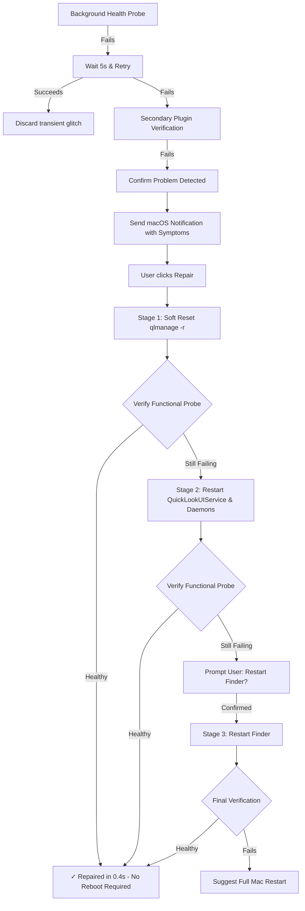

# Rebootless ⚡️
> **Detect and repair broken macOS subsystems before you reboot.**
> Your Mac often doesn’t need a full reboot—it needs the right subsystem repaired.

---

## 💡 The Core Idea

macOS is a robust operating system, but prolonged uptime and heavy multitasking can cause individual subsystems to become unresponsive:
- **Quick Look** spacebar previews show a blank box or hang indefinitely.
- **Force Click** previews stop opening.
- Background daemons deadlock while parent applications appear fine.

Most users either endure a disruptive full Mac reboot or struggle with obscure Terminal commands (`qlmanage -r`, `killall QuickLookUIService`, `launchctl kickstart`).

**Rebootless solves this with proactive health monitoring and staged, verified repairs.**

```
Monitor (conservative) ➔ Detect abnormal behavior ➔ Explain symptoms ➔ Notify ➔ Offer repair ➔ Least disruptive repair ➔ Verify recovery
```

---

## 🌟 How It Works

1. **Conservative Health Monitoring**: Runs periodic, non-intrusive functional checks against supported subsystems. Transient glitches are retried before confirming a problem to eliminate notification spam.
2. **Actionable Native Notifications**: When an issue is confirmed, Rebootless explains what you might be experiencing in plain English and offers a direct **[Repair]** button.
3. **Escalating Repair Recipes**: Repairs begin with the softest, least disruptive action (e.g. cache flush/soft reset). If verification fails, it escalates to service daemon restarts, and only asks to restart user-facing apps (like Finder) when strictly necessary.
4. **Independent Verification**: A shell command exiting with status 0 is **not** treated as "Fixed". Rebootless runs real functional probes to verify that the subsystem is truly healthy before claiming success.
5. **Recovery Detection**: If a subsystem recovers on its own, Rebootless detects the recovery, resolves the active issue, and avoids sending outdated notifications.
6. **Local Symptom Matching**: In the Troubleshooter, type what feels broken (e.g. *"spacebar preview doesn't work"*, *"force touch preview stopped working"*). Deterministic on-device matching connects your symptom directly to the right repair recipe. **No cloud. No LLM.**
7. **Direct Service Controls**: Power users can still manually restart individual services (Finder, Dock, Core Audio, DNS cache, Wi-Fi) directly from the Menu Bar or Dashboard.

---

## 🚦 Subsystem Implementation Roadmap

| Subsystem | Status | Proactive Monitoring | Staged Repair Recipe | Functional Verification |
|---|:---:|:---:|:---:|:---:|
| **Quick Look Previews** | **Available** | Real functional probe + retry + secondary verification | 3 stages: Soft Reset ➔ Daemon Restart ➔ Finder Reset (Confirmed) | Active (`qlmanage` server & thumbnail probes) |
| **Core Audio (Sound & Mic)** | *Planned* | Audio daemon & HAL device probe | Audio service reset ➔ HAL kickstart | Audio device enumeration |
| **DNS Cache & Resolution** | *Planned* | Resolution latency & loopback probe | Cache flush ➔ mDNSResponder HUP | Hostname resolution test |
| **Finder Subsystem** | *Planned* | Process & AppleEvent ping | Soft relaunch ➔ Process reset | Finder responsiveness probe |
| **Spotlight Indexer** | *Planned* | Indexing lock detection | Cache reset ➔ Daemon restart | Metadata query test |

---

## 🛠 Quick Look Reference Implementation Flow



---

## 🚀 Getting Started

### Requirements
- macOS 14.0 (Sonoma) or newer (including macOS Sequoia / macOS 26).
- Apple Silicon or Intel Mac.

### Building & Launching
```bash
# Build the release app bundle
./build_app.sh

# Launch Rebootless
open Rebootless.app
```

### Installing into Applications
```bash
cp -R Rebootless.app /Applications/
```

### Running Unit Tests
Rebootless includes a test suite covering the Health Monitor, Issue Tracker deduplication, escalation logic, verification checks, and symptom matching with mocks:
```bash
DEVELOPER_DIR=/Applications/Xcode.app/Contents/Developer swift test
```

---

## 🔒 Privacy & Safety

- **100% Local & Offline**: All health checks, symptom tokenizers, and repairs run strictly on your Mac. No network telemetry, no analytics, no cloud models.
- **Safety First**: Dangerous actions (like restarting Finder or WindowServer) require explicit confirmation.
- **Privilege Separation**: User-space services execute without elevated privileges; system-level daemons request macOS Touch ID / Password authorization transparently via system prompts.

---

## 📄 License
MIT License.
